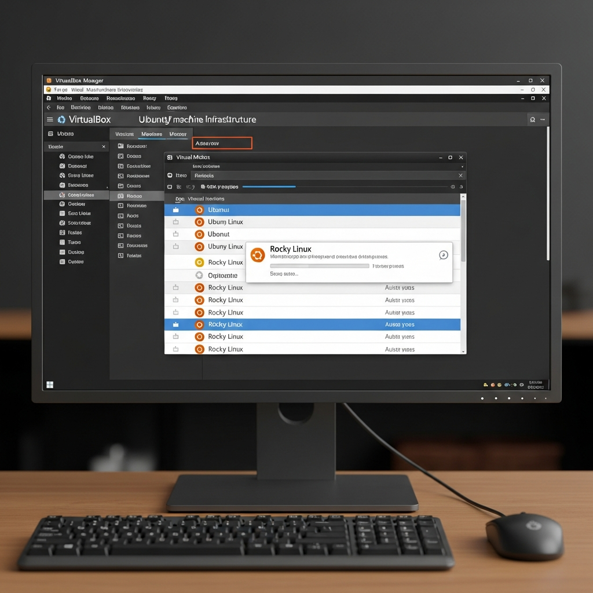

# 🖥️ Infraestructura — Entorno de Virtualización

> **Sección de Infraestructura** · Presentación · IFCT114PO

---

## 📖 Descripción

Esta sección contiene las **guías de configuración del entorno de prácticas** del curso IFCT114PO. Antes de comenzar con cualquier unidad formativa, es necesario preparar las máquinas virtuales sobre las que se realizarán todos los ejercicios prácticos.

Se trabaja con **VirtualBox 7** como hipervisor de virtualización, y se instalan dos distribuciones Linux ampliamente usadas en entornos profesionales: **Rocky Linux 10** (base RHEL, ideal para servidores empresariales) y **Ubuntu Server 24.04 LTS** (base Debian, muy extendida en cloud y DevOps).

---

## 🗂️ Índice de Ficheros

| 📁 Fichero | Tipo | Descripción |
|-----------|------|-------------|
| 📄 `00-Virtualización y VirtualBox 7 - Guía Completa.pdf` | Guía | Conceptos de virtualización e instalación/configuración completa de VirtualBox 7 |
| 📄 `01-Imagen OVA en VirtualBox - Guía de Importación.pdf` | Guía | Pasos para importar imágenes OVA preconfiguradas en VirtualBox |
| 📄 `02-Instalación de Rocky Linux 10 - Guía Paso a Paso.pdf` | Guía | Instalación completa de Rocky Linux 10 como máquina virtual |
| 📄 `03-Instalación de Ubuntu Server 24.04 LTS - Guía Paso a Paso.pdf` | Guía | Instalación completa de Ubuntu Server 24.04 LTS como máquina virtual |

---

## 🎯 Objetivos de esta Sección

- ✅ Comprender los conceptos básicos de la virtualización
- ✅ Instalar y configurar VirtualBox 7 en el equipo del alumno
- ✅ Crear y configurar máquinas virtuales correctamente
- ✅ Importar imágenes OVA preconfiguradas del curso
- ✅ Instalar Rocky Linux 10 desde cero en una VM
- ✅ Instalar Ubuntu Server 24.04 LTS desde cero en una VM

---

## 🔧 Orden de Configuración Recomendado

1. 📖 Leer la guía de **Virtualización y VirtualBox 7**
2. 💿 Instalar **VirtualBox 7** en tu equipo
3. 📥 Importar la **imagen OVA** del curso (si se proporciona) **— O —**
4. 🐧 Instalar **Rocky Linux 10** siguiendo la guía paso a paso
5. 🐧 Instalar **Ubuntu Server 24.04 LTS** siguiendo la guía paso a paso

---

[⬆️ Volver a Presentación](../README.md) · [🏠 Inicio](../../README.md)
