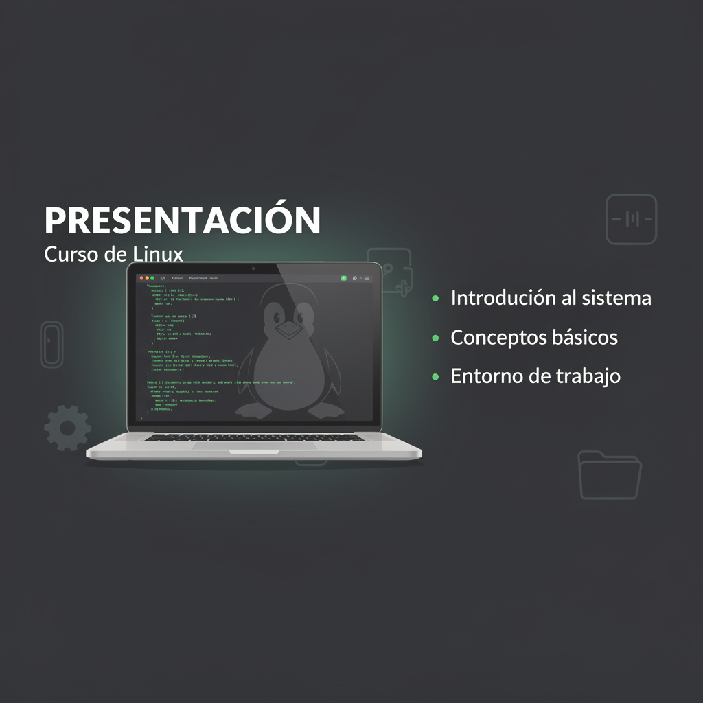

# 🎬 Presentación del Curso

> **Sección de Presentación e Infraestructura** del curso **IFCT114PO — Linux: Administración de Sistemas**

---

## 📖 Descripción

Esta sección contiene los materiales de **presentación general del curso** y las **guías de infraestructura** necesarias para configurar el entorno de prácticas. Antes de comenzar con los módulos teóricos, es fundamental preparar correctamente el entorno virtual donde se realizarán todas las prácticas del curso.

---

## 🗂️ Índice de Contenidos

### 📄 Ficheros en la raíz de Presentación

| 📁 Fichero | Descripción |
|-----------|-------------|
| 📊 `Curso 16.1 IFCT114PO - Linux.pdf` | Presentación general del curso: objetivos, estructura, metodología y evaluación |

---

### 🖥️ [Infraestructura](Infraestructura/README.md)

Guías paso a paso para configurar el entorno de virtualización necesario para las prácticas del curso.

| 📁 Fichero | Descripción |
|-----------|-------------|
| 📄 `00-Virtualización y VirtualBox 7 - Guía Completa.pdf` | Introducción a la virtualización y uso completo de VirtualBox 7 |
| 📄 `01-Imagen OVA en VirtualBox - Guía de Importación.pdf` | Cómo importar imágenes OVA preconfiguradas en VirtualBox |
| 📄 `02-Instalación de Rocky Linux 10 - Guía Paso a Paso.pdf` | Guía detallada para instalar Rocky Linux 10 como máquina virtual |
| 📄 `03-Instalación de Ubuntu Server 24.04 LTS - Guía Paso a Paso.pdf` | Guía detallada para instalar Ubuntu Server 24.04 LTS como máquina virtual |

---

## 🎯 Objetivos de esta Sección

- ✅ Conocer la estructura y objetivos generales del curso
- ✅ Instalar y configurar VirtualBox correctamente
- ✅ Preparar las máquinas virtuales con Rocky Linux y Ubuntu Server
- ✅ Disponer del entorno listo para todas las prácticas del curso

---

[🏠 Volver al inicio](../README.md)
